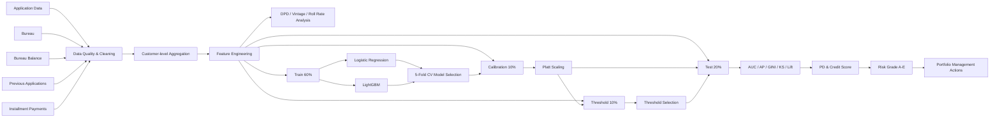
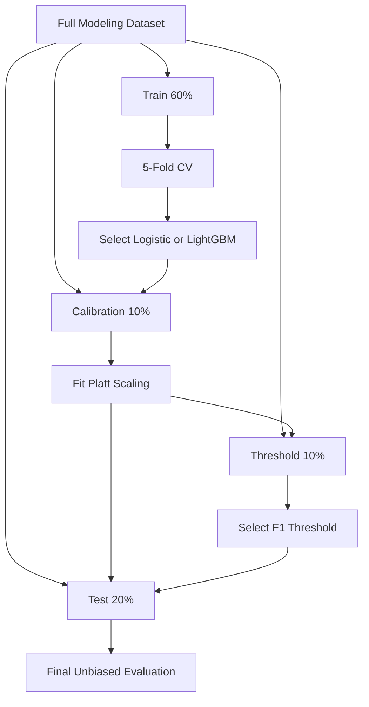

# Consumer Credit Risk Modeling

### End-to-End Credit Risk Analytics, PD Modeling & Portfolio Segmentation


## Tóm tắt 
Đây là dự án phân tích và dự báo rủi ro tín dụng tiêu dùng được xây dựng trên bộ dữ liệu **Home Credit**, bao gồm hơn **44,5 triệu dòng dữ liệu** từ hồ sơ vay, lịch sử tín dụng Bureau, lịch sử trạng thái theo tháng, hồ sơ vay trước và dữ liệu thanh toán trả góp.

Trong dự án này, tôi thực hiện toàn bộ quy trình:

- chuyển câu hỏi nghiệp vụ tín dụng thành bài toán phân tích dữ liệu và machine learning;
- kiểm tra chất lượng, độ phủ, missing, duplicate, mã bất thường và ngoại lai;
- tổng hợp dữ liệu quan hệ một–nhiều về đúng cấp khách hàng;
- xây dựng các đặc trưng về khả năng trả nợ, dư nợ, lịch sử quá hạn và hành vi thanh toán;
- phân tích **DPD, PAR30, Vintage proxy và Roll Rate**;
- xây dựng và so sánh **Logistic Regression** với **LightGBM**;
- kiểm soát data leakage bằng cách tách riêng train, calibration, threshold và test;
- hiệu chỉnh xác suất rủi ro bằng **Platt Scaling**;
- đánh giá mô hình bằng AUC, Average Precision, GINI, Brier Score, Log Loss, KS, Decile và Lift;
- chuyển xác suất vỡ nợ thành **Credit Risk Score** và **Risk Grade A–E**;
- chuyển kết quả kỹ thuật thành gợi ý quản trị danh mục và ưu tiên nguồn lực.

### Kết quả nổi bật

| Chỉ tiêu | Kết quả |
|---|---:|
| Số hồ sơ khách hàng | 307.511 |
| Quy mô dữ liệu nguồn | Hơn 44,5 triệu dòng |
| Số cột sau feature engineering | 214 |
| Số feature đưa vào mô hình | 143 |
| Mô hình được chọn | LightGBM |
| CV AUC | 0,7778 |
| Test AUC | **0,7844** |
| Average Precision | **0,2720** |
| GINI | **0,5688** |
| KS Statistic | **0,4338** |
| Top 30% khách hàng rủi ro cao | Chứa **69,43%** khách hàng xấu |
| Nhóm Risk Grade D–E | 25,84% khách hàng nhưng chứa **64,57%** khách hàng xấu |

> Dự án cho thấy khả năng xây dựng một pipeline phân tích rủi ro tín dụng hoàn chỉnh ở cấp độ portfolio. Mô hình được định vị là công cụ **xếp hạng, phân tầng và hỗ trợ ra quyết định**, không được trình bày như một quy tắc tự động phê duyệt hoặc từ chối hồ sơ.

---

## Bài toán kinh doanh

Tổ chức tín dụng không chỉ cần dự đoán khách hàng nào có khả năng phát sinh vấn đề trả nợ. Một hệ thống phân tích hữu ích còn cần trả lời:

1. Dữ liệu lịch sử của khách hàng có đầy đủ và đáng tin cậy không?
2. Những đặc trưng nào phản ánh khả năng trả nợ và hành vi rủi ro?
3. Khách hàng đang ở mức rủi ro nào so với toàn danh mục?
4. Mô hình có tập trung được khách hàng xấu vào nhóm ưu tiên hay không?
5. Xác suất dự báo có đủ gần với bad rate thực tế để diễn giải như PD không?
6. Bộ phận thẩm định và quản trị rủi ro nên ưu tiên nguồn lực vào nhóm nào?

Dự án giải quyết đồng thời hai hướng:

- **Phân tích lịch sử tín dụng:** DPD hiện tại, Ever DPD, delinquency trend, Vintage proxy và Roll Rate.
- **Dự báo danh mục:** ước lượng PD, xếp hạng khách hàng, phân Risk Grade và xây dựng nhóm hành động quản trị.

---

## Tôi có thể đóng góp gì cho doanh nghiệp?

### 1. Xây dựng dữ liệu phân tích rủi ro từ nhiều hệ thống

Tôi có thể tổng hợp dữ liệu từ hồ sơ khách hàng, CIC/Bureau, khoản vay trước, lịch trả nợ và giao dịch về một đơn vị phân tích nhất quán. Trong dự án này, mọi bảng lịch sử đều được tổng hợp về `SK_ID_CURR`, bảo đảm một dòng cuối cùng tương ứng với một hồ sơ khách hàng.

Điều này giúp doanh nghiệp:

- hạn chế nhân bản hồ sơ khi join dữ liệu một–nhiều;
- xây dựng data mart phục vụ risk analytics;
- phân biệt khách hàng không có lịch sử với khách hàng có lịch sử bằng 0;
- kiểm soát chất lượng đầu vào trước khi xây dựng mô hình.

### 2. Xây dựng mô hình PD có kiểm soát leakage

Pipeline tách biệt bốn quyết định:

- học tham số mô hình trên train;
- lựa chọn mô hình bằng cross-validation;
- hiệu chỉnh xác suất trên calibration set;
- chọn threshold trên threshold set;
- chỉ sử dụng test để báo cáo hiệu năng cuối cùng.

Thiết kế này giúp giảm nguy cơ báo cáo kết quả quá lạc quan và phù hợp hơn với tư duy model validation trong lĩnh vực tín dụng.

### 3. Chuyển mô hình thành công cụ ưu tiên nguồn lực

Mô hình không chỉ trả về nhãn tốt/xấu. Kết quả được chuyển thành:

- PD đã hiệu chỉnh;
- Credit Risk Score;
- Risk Decile;
- Risk Grade A–E;
- nhóm hành động quản trị.

Trong tập test:

- top 20% khách hàng có PD cao nhất chứa **55,73%** khách hàng xấu;
- top 30% chứa **69,43%** khách hàng xấu;
- nhóm D–E chỉ chiếm **25,84%** danh mục nhưng chứa **64,57%** trường hợp xấu.

Kết quả này minh họa cách mô hình có thể hỗ trợ:

- ưu tiên thẩm định bổ sung;
- phân bổ nguồn lực kiểm soát rủi ro;
- xây dựng danh sách cảnh báo sớm;
- ưu tiên theo dõi hoặc nhắc nợ;
- giảm khối lượng hồ sơ phải kiểm tra thủ công đồng đều.

### 4. Đánh giá mô hình theo góc nhìn quản trị, không chỉ accuracy

Do tỷ lệ khách hàng xấu chỉ khoảng 8,07%, accuracy có thể gây hiểu nhầm. Tôi sử dụng đồng thời:

- ROC-AUC và GINI để đánh giá khả năng phân biệt;
- Average Precision và Precision–Recall cho bài toán mất cân bằng;
- bootstrap confidence interval để đánh giá độ chắc chắn của chênh lệch AUC;
- Brier Score và Log Loss để kiểm tra chất lượng xác suất;
- KS, Decile, Lift và Bad Capture để đánh giá khả năng tập trung rủi ro;
- tính đơn điệu của bad rate theo Risk Grade để kiểm tra khả năng phân tầng.

### 5. Hiểu giới hạn của mô hình và yêu cầu triển khai thực tế

Dự án không đồng nhất `TARGET` với nợ xấu pháp lý tại Việt Nam và không gọi `PD × AMT_CREDIT` là Expected Loss khi chưa có LGD và EAD. Threshold tối đa F1 cũng không được sử dụng như cut-off phê duyệt.

Cách trình bày này thể hiện khả năng phân biệt giữa:

- mô hình nghiên cứu và mô hình production;
- ranking model và credit policy;
- xác suất thô và PD đã hiệu chỉnh;
- correlation và causal relationship;
- chỉ số kỹ thuật và hiệu quả kinh tế.

---

## Kiến trúc quy trình



### Thiết kế validation



---

## Dữ liệu sử dụng

Notebook sử dụng năm bảng chính:

| Bảng | Số dòng | Vai trò |
|---|---:|---|
| `application_train` | 307.511 | Hồ sơ vay hiện tại và biến mục tiêu |
| `bureau` | 1.716.428 | Lịch sử tín dụng tại tổ chức khác |
| `bureau_balance` | 27.299.925 | Trạng thái khoản Bureau theo tháng |
| `previous_application` | 1.670.214 | Các hồ sơ vay trước |
| `installments_payments` | 13.605.401 | Lịch thanh toán trả góp |

Hai bảng `POS_CASH_balance` và `credit_card_balance` không được đưa vào mô hình cuối nhằm giới hạn bộ nhớ và giữ khả năng tái lập trên môi trường Colab thông thường.

### Biến mục tiêu

- `TARGET = 0`: khách hàng không thuộc nhóm có vấn đề trả nợ theo định nghĩa dữ liệu.
- `TARGET = 1`: khách hàng thuộc nhóm có vấn đề trả nợ.
- Bad rate toàn bộ dữ liệu: khoảng **8,07%**.
- Tỷ lệ khách hàng tốt/xấu: khoảng **11,39:1**.

> `TARGET` trong bộ dữ liệu không hoàn toàn tương đương default, NPL hoặc nợ xấu theo quy định pháp lý của một ngân hàng cụ thể.

---

## Kiểm tra và xử lý chất lượng dữ liệu

### Duplicate và khóa dữ liệu

- Không có hàng trùng hoàn toàn trong `application_train`.
- `SK_ID_CURR` là duy nhất trong bảng hồ sơ chính.
- Dữ liệu một–nhiều ở các bảng lịch sử được xem là quan hệ hợp lệ, sau đó được aggregate trước khi merge.

### Missing values

Notebook không tự động xóa mọi cột có missing cao. Việc xử lý phụ thuộc vào ý nghĩa nghiệp vụ:

- giữ lại nhóm `EXT_SOURCE` dù có missing cao vì có tín hiệu dự báo mạnh;
- tạo missing flags để mô hình nhận biết trạng thái thiếu;
- Logistic Regression impute bên trong pipeline CV;
- LightGBM xử lý missing native;
- tạo `HAS_*_HISTORY` để phân biệt không có lịch sử với giá trị thực bằng 0.

### Mã bất thường

`DAYS_EMPLOYED = 365243` xuất hiện ở 55.374 hồ sơ, tương đương hơn 1.000 năm làm việc nếu diễn giải trực tiếp. Notebook:

- tạo cờ `DAYS_EMPLOYED_ANOMALY`;
- chuyển giá trị bất thường về `NaN`;
- giữ lại tín hiệu “không áp dụng hoặc không xác định”.

### Ngoại lai

Các biến tiền tệ có phân phối lệch phải và nhiều giá trị lớn vẫn có thể là hồ sơ hợp lệ. Vì vậy:

- không xóa cơ học theo IQR;
- LightGBM giữ nguyên giá trị;
- Logistic Regression sử dụng `QuantileClipper` được fit riêng trong từng fold train.

---

## Feature Engineering

Master dataset sau khi tổng hợp có **307.511 khách hàng và 214 cột**. Bộ dữ liệu mô hình cuối gồm **143 feature**, trong đó có 131 feature số và 12 feature phân loại.

### Nhóm đặc trưng hồ sơ và khả năng trả nợ

- tuổi và thâm niên làm việc;
- tỷ lệ tín dụng/thu nhập;
- tỷ lệ niên kim/thu nhập;
- tỷ lệ niên kim/tín dụng;
- thu nhập bình quân theo thành viên gia đình;
- thời hạn tín dụng xấp xỉ;
- các tương tác giữa số tiền vay, giá hàng hóa và nghĩa vụ trả nợ.

### Nhóm điểm tín dụng ngoài

- `EXT_SOURCE_MEAN`;
- `EXT_SOURCE_MIN`;
- `EXT_SOURCE_MAX`;
- độ lệch chuẩn;
- tích các nguồn điểm;
- số lượng nguồn bị thiếu.

### Nhóm Bureau

- số khoản tín dụng;
- số và tỷ lệ khoản active;
- tổng hạn mức và dư nợ;
- tỷ lệ dư nợ/tín dụng;
- số khoản đang quá hạn;
- current DPD;
- Ever DPD/PAR30/DPD 90+ proxy;
- trạng thái trong sáu tháng tương đối gần nhất.

### Nhóm Previous Applications

- số hồ sơ trước;
- tỷ lệ được chấp thuận và từ chối;
- thời điểm quyết định;
- tỷ lệ số tiền yêu cầu/được cấp;
- các đặc trưng về khoản vay và sản phẩm trước.

### Nhóm Installment Payments

Dữ liệu được aggregate về **cấp kỳ thanh toán** trước khi tổng hợp về khách hàng để tránh cộng lặp khi một kỳ được trả nhiều lần.

Các feature gồm:

- số kỳ thanh toán;
- số kỳ trễ hạn;
- số kỳ trả thiếu;
- số ngày trễ;
- payment ratio;
- hành vi trong 12 kỳ gần nhất.

### Cờ độ phủ lịch sử

- `HAS_BUREAU_HISTORY`;
- `HAS_BUREAU_BALANCE_HISTORY`;
- `HAS_PREVIOUS_APPLICATION_HISTORY`;
- `HAS_INSTALLMENT_HISTORY`.

Những cờ này giúp mô hình không đánh đồng khách hàng không có dữ liệu với khách hàng có lịch sử hoàn hảo.

---

## Phân tích DPD, Vintage và Roll Rate

### Current DPD và Ever DPD

Notebook phân biệt:

- **Current DPD:** trạng thái quá hạn hiện tại của khoản Bureau active.
- **Ever DPD:** mức quá hạn xấu nhất từng quan sát trong `bureau_balance`.

Chỉ **38,65%** khoản Bureau có trạng thái số 0–5 xác định. Vì vậy, mọi tỷ lệ Ever DPD đều được báo cáo kèm coverage và mẫu số phù hợp. Khoản thiếu lịch sử hoặc chỉ có trạng thái `X` không bị mặc định là khách hàng tốt.

### Roll Rate


Một số chuyển dịch đáng chú ý:

| Chuyển trạng thái | Tỷ lệ |
|---|---:|
| Current → DPD 1–30 | 2,13% |
| DPD 1–30 → Current | 49,55% |
| DPD 31–60 → DPD 61–90 | 31,49% |
| DPD 61–90 → DPD 90+ proxy | 56,81% |
| DPD 90+ proxy → DPD 90+ proxy | 92,80% |

Kết quả cho thấy:

- DPD 1–30 vẫn có khả năng phục hồi đáng kể;
- rủi ro chuyển nặng tăng mạnh sau DPD 30;
- DPD 1–60 là vùng phù hợp để ưu tiên nhắc nợ, tái đánh giá và can thiệp sớm.

> Roll Rate trong dự án phản ánh lịch sử Bureau, không phải mô hình collection của khoản vay hiện tại.

---

## Xây dựng mô hình

### Chia dữ liệu

| Tập | Tỷ trọng | Số hồ sơ | Mục đích |
|---|---:|---:|---|
| Train | 60% | 184.506 | Học tham số và cross-validation |
| Calibration | 10% | 30.751 | Fit Platt Scaling |
| Threshold | 10% | 30.751 | Chọn threshold |
| Test | 20% | 61.503 | Đánh giá cuối cùng |

Tất cả các tập có bad rate gần 8,07% nhờ stratified split và được kiểm tra không trùng index.

### Logistic Regression

Logistic Regression được sử dụng như baseline dễ kiểm tra:

- median imputation và missing indicator cho biến số;
- most-frequent imputation và one-hot encoding cho biến phân loại;
- scaling;
- capping cho một số biến tiền tệ;
- `class_weight='balanced'`;
- toàn bộ preprocessing nằm bên trong pipeline CV.

Kết quả:

| Chỉ tiêu | Giá trị |
|---|---:|
| CV AUC | 0,7650 ± 0,0034 |
| Calibration AUC | 0,7623 |
| Threshold-set AUC | 0,7714 |
| Test AUC | 0,7699 |
| Test Average Precision | 0,2532 |
| GINI | 0,5399 |

### LightGBM

LightGBM sử dụng:

- missing native;
- categorical feature native;
- 5-fold stratified CV giống Logistic Regression;
- early stopping;
- tuning có kiểm soát trên bốn cấu hình;
- class weight như một hyperparameter;
- regularization L1/L2;
- feature fraction và bagging.

Cấu hình tốt nhất:

```python
{
    "learning_rate": 0.04,
    "num_leaves": 31,
    "max_depth": -1,
    "min_child_samples": 60,
    "feature_fraction": 0.80,
    "bagging_fraction": 0.85,
    "bagging_freq": 1,
    "lambda_l1": 0.20,
    "lambda_l2": 2.00,
    "scale_pos_weight": 3.3745,
    "n_estimators": 476
}
```

Kết quả:

| Chỉ tiêu | Giá trị |
|---|---:|
| CV AUC | **0,7778** |
| Calibration AUC | **0,7766** |
| Threshold-set AUC | **0,7843** |
| Test AUC | **0,7844** |
| Test Average Precision | **0,2720** |
| GINI | **0,5688** |

LightGBM được chọn vì CV AUC cao hơn Logistic Regression **0,0128**, vượt quy tắc cải thiện tối thiểu 0,002 đã xác định trước.

---

## So sánh mô hình

| Chỉ tiêu test | Logistic Regression | LightGBM |
|---|---:|---:|
| AUC | 0,7699 | **0,7844** |
| Average Precision | 0,2532 | **0,2720** |
| GINI | 0,5399 | **0,5688** |
| AP / Bad-rate nền | 3,1370 | **3,3699** |

### ROC Curve


### Precision–Recall Curve


Do lớp xấu chỉ chiếm 8,07%, Precision–Recall cung cấp góc nhìn thực tế hơn accuracy. Average Precision của LightGBM cao gấp **3,37 lần** bad rate nền.

### Bootstrap confidence interval

Notebook thực hiện bootstrap phân tầng 500 lần:

| Mô hình | AUC | Khoảng tin cậy 95% |
|---|---:|---:|
| Logistic Regression | 0,7699 | [0,7629; 0,7775] |
| LightGBM | 0,7844 | [0,7782; 0,7912] |

Chênh lệch AUC LightGBM – Logistic là **0,0145**, với khoảng tin cậy 95% **[0,0116; 0,0173]**. Khoảng này không chứa 0 trên tập kiểm tra hiện tại.

---

## Feature Importance


Các feature có gain share cao nhất:

| Feature | Gain share |
|---|---:|
| `EXT_SOURCE_MEAN` | 26,90% |
| `ORGANIZATION_TYPE` | 9,84% |
| `EXT_SOURCE_MIN` | 2,68% |
| `PREV_CREDIT_APPLICATION_RATIO_MEAN` | 2,26% |
| `OCCUPATION_TYPE` | 2,10% |
| `ANNUITY_CREDIT_RATIO` | 2,03% |
| `EXT_SOURCE_3` | 1,88% |
| `EXT_SOURCE_MAX` | 1,75% |
| `CREDIT_TERM_MONTHS_APPROX` | 1,55% |
| `AGE_YEARS` | 1,52% |

Feature importance được diễn giải thận trọng:

- không chứng minh quan hệ nhân quả;
- không thể hiện chiều tác động;
- không thay thế giải thích cấp khách hàng;
- cần bổ sung SHAP trước khi triển khai quy trình giải thích quyết định.

---

## Hiệu chỉnh xác suất PD

Cấu hình LightGBM tốt nhất sử dụng `scale_pos_weight`, do đó xác suất thô bị đẩy cao hơn bad rate thực tế. Notebook fit **Monotonic Platt Scaling** trên calibration set riêng.

| Phiên bản | AUC | Brier Score | Log Loss | PD trung bình |
|---|---:|---:|---:|---:|
| LightGBM thô | 0,7844 | 0,0831 | 0,2917 | 18,78% |
| Sau Platt Scaling | 0,7844 | **0,0663** | **0,2382** | **8,07%** |
| Bad rate thực tế |  |  |  | 8,07% |


Platt Scaling:

- giữ nguyên khả năng xếp hạng nên AUC không thay đổi;
- đưa PD trung bình về gần bad rate thực tế;
- cải thiện Brier Score và Log Loss;
- giúp đầu ra phù hợp hơn để phân tầng và truyền đạt dưới dạng PD.

---

## Threshold và ma trận nhầm lẫn

Threshold tối đa F1 được chọn trên threshold set riêng:

- threshold: **0,1872**;
- F1 trên threshold set: **0,3454**;
- F1 trên test: **0,3248**.

Kết quả test tại ngưỡng này:

| Chỉ tiêu | Giá trị |
|---|---:|
| Accuracy | 87,34% |
| Precision lớp rủi ro | 28,51% |
| Recall lớp rủi ro | 37,72% |
| F1 lớp rủi ro | 32,48% |

Threshold này chỉ minh họa trade-off kỹ thuật. Một credit cut-off thực tế cần thêm:

- chi phí false positive và false negative;
- LGD và EAD;
- biên lợi nhuận;
- chi phí vốn;
- khẩu vị rủi ro;
- năng lực thẩm định;
- quy định pháp lý và chính sách sản phẩm.

---

## KS, Decile và Lift

### KS Curve


- KS Statistic: **0,4338**.
- Điểm KS xuất hiện tại 32,67% dân số có PD cao nhất.
- Nhóm này tập trung 72,55% khách hàng xấu.

### Bad rate theo Decile


- Decile 1 có bad rate **29,20%**.
- Lift của Decile 1 đạt **3,6169**.
- Decile 1 chứa **36,17%** tổng số khách hàng xấu.
- Bad rate giảm đơn điệu từ **29,20%** ở Decile 1 xuống **0,83%** ở Decile 10.

### Cumulative Bad Capture


| Phần danh mục ưu tiên | Tỷ lệ khách hàng xấu được tập trung |
|---|---:|
| Top 10% | 36,17% |
| Top 20% | 55,73% |
| Top 30% | 69,43% |

Đây là kết quả có ý nghĩa trực tiếp đối với phân bổ nguồn lực: doanh nghiệp có thể tập trung review hoặc giám sát vào một phần danh mục thay vì xử lý mọi khách hàng với cường độ giống nhau.

---

## Credit Risk Score

PD đã hiệu chỉnh được chuyển thành điểm bằng công thức:

```text
Score = Offset + Factor × ln((1 - PD) / PD)
```

Quy ước minh họa:

- Base Score: 600;
- Base Odds tốt/xấu: 50:1;
- PDO: 20;
- giới hạn điểm: 300–850.

Kết quả:

| Nhóm | Điểm trung bình | Điểm trung vị | PD trung bình |
|---|---:|---:|---:|
| Khách hàng tốt | 573,43 | 575,18 | Khoảng 7% |
| Khách hàng rủi ro | 540,33 | 539,08 | Khoảng 18% |

Credit Score là phép biến đổi đơn điệu của PD. Nó không tạo thêm sức mạnh dự báo nhưng giúp truyền đạt kết quả thuận tiện hơn cho bộ phận kinh doanh và quản trị.

---

## Risk Grade A–E

| Hạng | Khoảng PD | Mức rủi ro |
|---|---:|---|
| A | PD ≤ 3% | Rất thấp |
| B | 3% < PD ≤ 6% | Thấp |
| C | 6% < PD ≤ 10% | Trung bình |
| D | 10% < PD ≤ 20% | Cao |
| E | PD > 20% | Rất cao |


| Hạng | Tỷ trọng khách hàng | Bad rate | PD trung bình | Điểm trung bình |
|---|---:|---:|---:|---:|
| A | 31,98% | 1,60% | 1,81% | 604,86 |
| B | 25,40% | 4,17% | 4,32% | 577,05 |
| C | 16,77% | 7,68% | 7,78% | 558,77 |
| D | 16,47% | 14,52% | 14,05% | 539,95 |
| E | 9,38% | 30,09% | 29,57% | 512,96 |

Bad rate tăng đơn điệu từ A đến E, cho thấy mô hình phân tầng rủi ro nhất quán.

### Góc nhìn danh mục

- D–E chiếm **25,84%** khách hàng nhưng chứa **64,57%** khách hàng xấu.
- D–E chiếm **23,44%** tổng số tiền tín dụng nhưng tạo **59,98%** tổng phơi nhiễm có trọng số PD.
- A–B chiếm **57,38%** khách hàng nhưng chỉ chứa **19,48%** khách hàng xấu.

> `PD × AMT_CREDIT` trong dự án là phơi nhiễm có trọng số PD, chưa phải Expected Loss vì chưa có LGD và EAD chuẩn hóa.

---

## Gợi ý hành động quản trị

| Nhóm | Risk Grade | Mục đích minh họa |
|---|---|---|
| Quản lý thông thường | A–B | Quy trình quản lý chuẩn |
| Theo dõi tăng cường | C | Bổ sung theo dõi và tín hiệu cảnh báo |
| Ưu tiên kiểm soát rủi ro | D–E | Ưu tiên thẩm định, giám sát hoặc can thiệp |

| Nhóm hành động | Tỷ trọng khách hàng | Số khách hàng xấu | Bad rate | PD trung bình |
|---|---:|---:|---:|---:|
| Quản lý thông thường | 57,38% | 967 | 2,74% | 2,92% |
| Theo dõi tăng cường | 16,77% | 792 | 7,68% | 7,78% |
| Ưu tiên kiểm soát rủi ro | 25,84% | 3.206 | 20,17% | 19,68% |

Nhóm ưu tiên kiểm soát chỉ chiếm khoảng một phần tư danh mục nhưng chứa 3.206/4.965 trường hợp xấu.

---

## Các quyết định kỹ thuật quan trọng

| Quyết định | Lý do |
|---|---|
| Aggregate bảng lịch sử trước khi merge | Tránh nhân bản hồ sơ và sai biến mục tiêu |
| Aggregate installment theo kỳ thanh toán | Tránh cộng lặp khi một kỳ được trả nhiều lần |
| Giữ missing cho LightGBM | Tận dụng missing native |
| Impute Logistic bên trong pipeline CV | Ngăn leakage từ phân phối toàn dữ liệu |
| Tách calibration set | Không dùng test để hiệu chỉnh PD |
| Tách threshold set | Không dùng test để chọn điểm vận hành |
| Dùng cùng CV fold cho hai mô hình | Bảo đảm so sánh công bằng |
| Chọn mô hình bằng CV thay vì test | Giữ test độc lập |
| Bootstrap CI cho AUC | Đánh giá độ chắc chắn của kết quả |
| Kiểm tra monotonicity của grade | Xác nhận khả năng phân tầng danh mục |
| Không xóa ngoại lai cơ học | Tránh làm mất khách hàng hợp lệ có giá trị lớn |
| Không xem missing history là tốt | Giảm sai lệch do coverage |

---

## Kiểm tra tự động

Notebook có các assertion cuối pipeline:

- các tập train, calibration, threshold và test không trùng index;
- `TARGET` không xuất hiện trong feature;
- PD hữu hạn và nằm trong khoảng `[0, 1]`;
- số PD khớp số quan sát test;
- Decile và Risk Grade bao phủ toàn bộ test;
- bad rate tăng đơn điệu từ Grade A đến E.

Các kiểm tra này giúp phát hiện lỗi kỹ thuật phổ biến trước khi kết luận.

---

## Công nghệ sử dụng

### Data processing

- Python
- Pandas
- NumPy
- SciPy
- KaggleHub

### Machine learning

- scikit-learn
- LightGBM
- Logistic Regression
- Stratified K-Fold Cross-Validation
- Early Stopping
- Class Weight
- Platt Scaling

### Credit risk analytics

- Probability of Default
- DPD và PAR30
- Vintage Analysis
- Roll Rate
- ROC-AUC và GINI
- Precision–Recall
- Brier Score và Log Loss
- KS Statistic
- Decile, Lift và Bad Capture
- Credit Risk Score
- Risk Grade
- PD-weighted Exposure

### Visualization

- Matplotlib
- Seaborn

---

## Cấu trúc repository

```text
consumer-credit-risk-portfolio/
├── Consumer Credit Risk Modeling.ipynb
├── README.md
├── requirements.txt
└── assets/
    ├── roll-rate-matrix.png
    ├── feature-importance.png
    ├── roc-curve.png
    ├── precision-recall-curve.png
    ├── calibration-curve.png
    ├── ks-curve.png
    ├── bad-rate-by-decile.png
    ├── cumulative-bad-capture.png
    └── risk-grade-validation.png
```

---

## Cách chạy dự án

### 1. Clone repository

```bash
git clone <YOUR_REPOSITORY_URL>
cd consumer-credit-risk-portfolio
```

### 2. Tạo môi trường Python

```bash
python -m venv .venv
```

Windows:

```bash
.venv\Scripts\activate
```

macOS/Linux:

```bash
source .venv/bin/activate
```

### 3. Cài thư viện

```bash
pip install -r requirements.txt
```

### 4. Mở notebook

```bash
jupyter notebook "Consumer Credit Risk Modeling.ipynb"
```

Có thể chạy trực tiếp trên Google Colab. Notebook tự tải dữ liệu bằng:

```python
import kagglehub
path = kagglehub.dataset_download("julianocosta/home-credit")
```

Hoặc thay bằng đường dẫn dữ liệu local:

```python
DATA_DIR = Path("/path/to/home-credit")
```

### 5. Chạy toàn bộ notebook

Chọn **Run All** theo thứ tự từ trên xuống. Do `bureau_balance` và `installments_payments` có quy mô lớn, cần bảo đảm môi trường có đủ RAM. Cấu hình mặc định đã tắt hai bảng mở rộng POS/CASH và Credit Card để giảm yêu cầu tài nguyên.

---

## Kết quả đầu ra của notebook

Notebook tạo ra:

- báo cáo chất lượng và độ phủ dữ liệu;
- phân tích missing và ngoại lai;
- bộ đặc trưng khách hàng;
- bảng DPD theo phân khúc;
- delinquency trend theo tháng tương đối;
- Vintage proxy;
- Roll Rate matrix;
- kết quả CV và tuning;
- ROC và Precision–Recall curve;
- bootstrap confidence interval;
- feature importance;
- calibration curve;
- confusion matrix;
- threshold trade-off;
- KS curve;
- Decile, Lift và Bad Capture;
- Credit Risk Score;
- Risk Grade A–E;
- bảng hành động quản trị danh mục.

---


